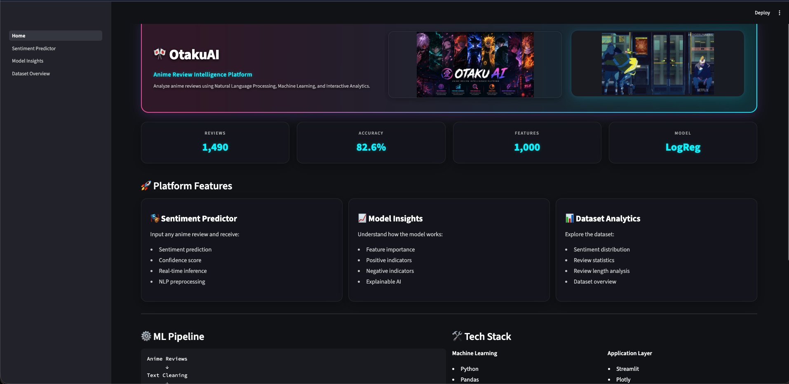
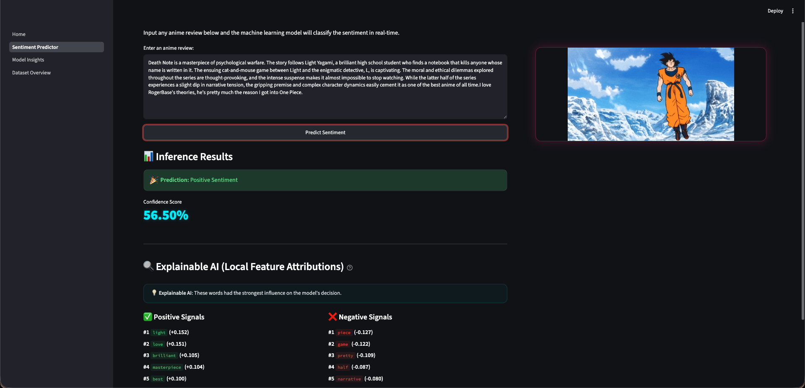
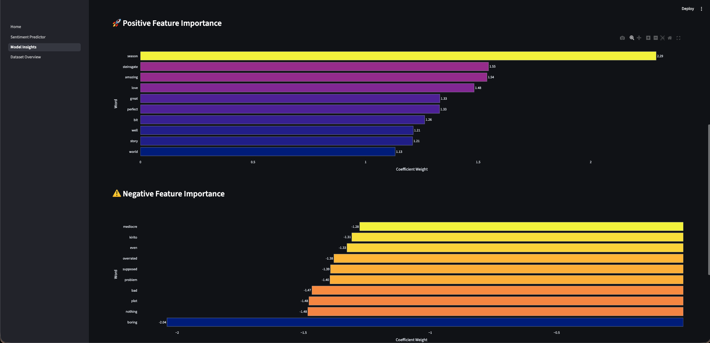
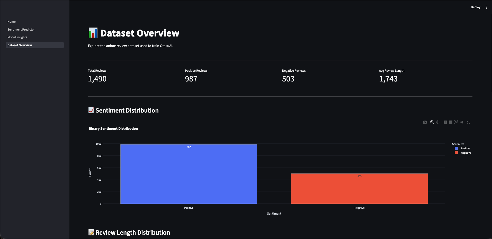

<p align="center">
  
</p>

<h1 align="center">🎌 OtakuAI</h1>

<p align="center">
  <b>Anime Review Sentiment Intelligence Platform</b><br>
  <i>An end-to-end Machine Learning and NLP application that extracts sentiment indicators and analyzes anime reviews in real-time.</i>
</p>

<p align="center">
  
  
  
  
  
  
  
  
  
</p>

---

## 🌌 Project Overview

**OtakuAI** is an end-to-end Natural Language Processing (NLP) application designed to classify sentiment within anime reviews. Leveraging classical machine learning classifiers trained on preprocessed textual data, the platform goes beyond simple binary prediction by utilizing **Explainable AI (XAI)**. This allows users to inspect exactly how the model assigns weights to specific vocabulary elements to form its decisions.

All models and analysis pipelines are wrapped in a premium, dark-cyberpunk styled dashboard, providing a sleek SaaS landing page experience.

---

## 🚀 Key Features

* **🤖 Sentiment Prediction**: Real-time text area inference. Input any anime review to determine if the review expresses positive or negative sentiments along with probability metrics.
* **🔍 Explainable AI (XAI)**: Displays local feature attributions on reviews using TF-IDF vectors and model coefficients. Highlights top positive (green) and negative (red) keywords in ranked lists and horizontal Plotly bars.
* **📈 Model Insights**: Discover the model's global parameters, features weight distribution, and positive vs. negative word clouds.
* **📊 Dataset Analytics**: Interactive overview of data distributions, vocabulary counts, and review lengths.
* **🎨 Interactive Dashboard**: Cyberpunk anime themed interface styled with glassmorphism, animated borders, and fade-in effects.

---

## 📸 Dashboard Preview

| Home Page | Sentiment Predictor (XAI) |
| :---: | :---: |
|  |  |
| **Model Insights** | **Dataset Overview** |
|  |  |

---

<p align="center">
  
</p>

---

## 📊 Model Performance

The classification engine uses a **Logistic Regression** classifier paired with a **TF-IDF Vectorizer** (vocabulary size restricted to 1,000 features).

### Evaluation Metrics
| Metric | Value |
| :--- | :---: |
| **Accuracy** | **82.6%** |

### Confusion Matrix
| Actual \ Predicted | Predicted Negative | Predicted Positive |
| :--- | :---: | :---: |
| **Actual Negative** | **62** (True Negative) | **15** (False Positive) |
| **Actual Positive** | **28** (False Negative) | **142** (True Positive) |

---

## ⚙️ ML Pipeline

```text
       Anime Reviews
             ↓
       Text Cleaning (NLTK Tokenizer, Lemmatizer & Stopword Filters)
             ↓
       TF-IDF Vectorization (1,000 max features)
             ↓
       Logistic Regression Classifier
             ↓
       Sentiment Prediction (Positive/Negative Classification)
             ↓
       Explainable AI (Word Attribution = TF-IDF value × Coefficient)
             ↓
       Interactive Streamlit Dashboard
```

---

## 🛠️ Tech Stack

* **Machine Learning**: Python, Scikit-Learn, NLTK
* **Data Analysis**: Pandas, NumPy
* **Visualization**: Plotly, Matplotlib, WordCloud
* **Application Layer**: Streamlit, HTML5, Custom CSS

---

## 📂 Project Structure

```text
otaku-ai/
├── assets/
│   ├── otakuai_banner.png
│   └── screenshots/
│       ├── home.png
│       ├── predictor.png
│       ├── insights.png
│       └── dataset.png
├── dashboard/
│   ├── Home.py
│   └── pages/
│       ├── 1_Sentiment_Predictor.py
│       ├── 2_Model_Insights.py
│       └── 3_Dataset_Overview.py
├── data/
├── notebooks/
├── src/
│   └── features/
│       └── text_preprocessing.py
├── tests/
├── pyproject.toml
├── uv.lock
└── README.md
```

---

## 📥 Installation

Ensure you have [uv](https://github.com/astral-sh/uv) installed.

1. **Clone the repository**:
   ```bash
   git clone https://github.com/manasscodes/otaku-ai.git
   cd otaku-ai
   ```

2. **Sync dependencies**:
   ```bash
   uv sync
   ```

3. **Launch the dashboard**:
   ```bash
   uv run streamlit run dashboard/Home.py
   ```

---

## 🔮 Future Improvements

* [ ] **Transformer Ensembles**: Fine-tune pre-trained models (e.g. BERT, RoBERTa) to capture complex semantic structures.
* [ ] **Recommendation System**: Link sentiment indicators to recommend similar anime profiles.
* [ ] **RAG Assistant**: Introduce a Retrieval-Augmented Generation chat interface using local database indices.
* [ ] **Cloud Deployment**: Containerize the app and deploy it on Cloud Run / GCP Hosting.

---

## ✍️ Author

* **Manas Kolaskar**
* GitHub: [@manasscodes](https://github.com/manasscodes)

If you find this project interesting, please consider giving it a ⭐ on [GitHub](https://github.com/manasscodes/otaku-ai)!
